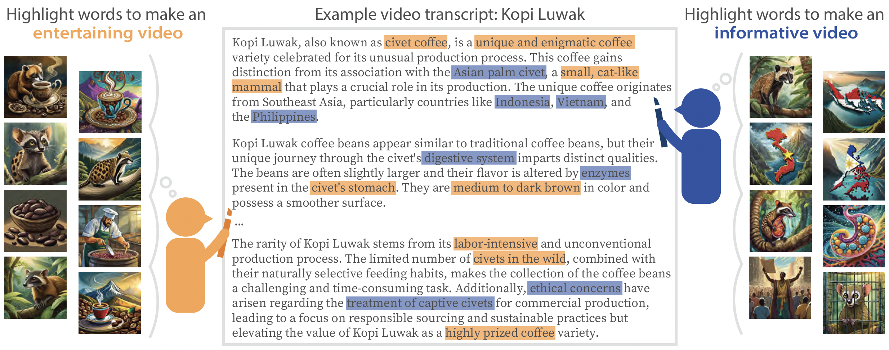
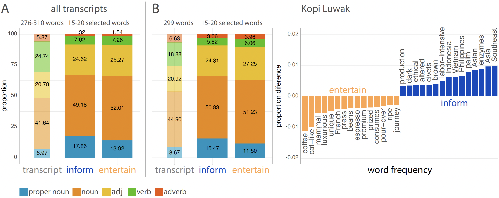
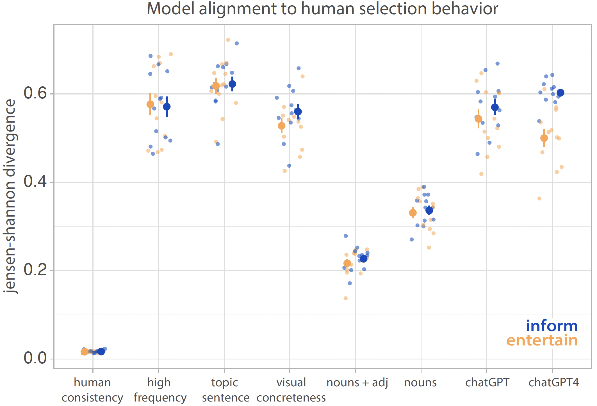

# How do video content creation goals impact which concepts people prioritize for generating B-roll imagery?
#### Holly Huey, Mackenzie Leake, Deepali Aneja, Matthew Fisher, & Judith E. Fan

B-roll is vital when producing high-quality videos, but finding the right images can be difficult and time-consuming. Moreover, what B-roll is most effective can depend on a video content creator's intent---is the goal to entertain, to inform, or something else? While new text-to-image generation models provide promising avenues for streamlining B-roll production, it remains unclear how these tools can provide support for content creators with different goals. 

To close this gap, we aimed to understand how video content creator's goals guide which visual concepts they prioritize for B-roll generation. Here we introduce a benchmark containing judgments from >800 people as to which terms in $12$ video transcripts should be assigned highest priority for B-roll imagery accompaniment. We verified that participants reliably prioritized different visual concepts depending on whether their goal was help produce _informative_ or _entertaining_ videos. We next explored how well several algorithms, including heuristic approaches and large language models (LLMs), could predict systematic patterns in human judgments. We found that none of these methods fully captured human judgments in either goal condition, with state-of-the-art LLMs (i.e., GPT-4) even underperforming a baseline that sampled only nouns or nouns and adjectives. Overall, our work identifies opportunities for improvement in future algorithms that could lead to simpler and more streamlined video production workflows.

### Methods
12 transcripts spanning 4 popular video topics were generated by ChatGPT: _food_: Almas caviar, Murnong, Kopi Luwak coffee;  _fashion_: African kanzu, Indonesian kebaya, Mongolian deel; _city travel_: Vilnius, Lichinga, Cuenca; _animals_: vaquita, saola, dugong. For each transcript, ChatGPT generated a description spanning 5 topically focused paragraphs, 3 sentences each. Transcripts were approximately matched in word count and audio recorded.

Participants viewed the video transcripts on a custom web-based experiment platform. They were told the transcripts would later be converted into talking head videos (i.e., in which a speaker talks directly to the camera), but were currently missing B-roll. During each trial, participants viewed one transcript and listened to its audio recording.  They were instructed to highlight segments of consecutive text with their cursor (e.g., "long pointed horns") that they believed would be best portrayed as B-roll. Participants were told a video editor would receive their highlighted transcripts and use their highlights to create B-roll for the final videos. Participants were instructed to highlight 15-20 words and told each highlighted text segment corresponded to one B-roll image.

Half of participants helped produce _informative_ videos intended to help viewers remember the transcript content for general life knowledge or school test. The other half of participants helped produce _entertaining_ videos intended to motivate viewers to ``like'', write comments, or subscribe to a video channel.

  </img>

# Results
Participants prioritizing informativity highlighted more proper nouns and fewer nouns and adverbs, relative to those prioritizing entertainment. We did not find significant differences in the frequency of verbs or adjectives between goal conditions. However, we compared the proportion of proper nouns, nouns, adjectives, verbs, and adverbs in participants' highlighted text segments against the base rate of proper nouns, nouns, adjectives, verbs, and adverbs in the transcripts. Across both conditions, participants highlighted more adjectives but fewer verbs, relative to the transcript base rate of adjectives and verbs.
Additionally, participants in both conditions highlighted more proper nouns and nouns and less adverbs, relative to the transcript base rate of proper nouns and adverbs. 
These results indicate that video content creation goals systematically shifted which words participants prioritized within the video transcripts. 

  </img>

### Predicting human visual concept selection using text selection models
What might explain how people select visual concepts for B-roll in informative or entertaining videos? 

We evaluated several heuristic approaches for text selection and compared their alignment to human judgments. For each model, we generated simulated datasets consisting of the same number of word selections as participants within each goal condition. 
We then employed Jensen–Shannon divergence (JSD) to measure the difference between the probability of a word being selected by a model against the observed frequency of that same word being selected by human participants (0 = identical alignment). 
We tested three heuristic models: 

(1) Word frequency: 
Insofar as people prioritize visual concepts highly relevant to a video topic, we predicted people would be biased to choose words appearing at a higher frequency within transcripts. 
To generate word selections, we randomly sampled the top 20 most frequently included words from each transcript. 

(2) Topic sentence selection: 
To the extent that topic sentence expresses the main idea of a paragraph, we evaluated whether people are biased to select words from the first sentence of each transcript paragraph.
To generate word selections, we randomly sampled words from the first sentence of each transcript paragraph, excluding stopwords.

(3) Visual concreteness: 
Because B-roll is inherently visual, we evaluated whether participants prioritized words more strongly evoking visual imagery. 
Using visual concreteness ratings \cite{brysbaert2014concreteness} (1 = abstract, 5 = concrete), we generated concreteness scores for each word in the transcripts. 
Building on work leveraging these scores to auto-generate slideshow imagery \cite{leake2020generating}, we randomly sampled words scoring > 4.5 and filled in remaining word selections, if needed, with words scoring > 3.
We predicted people would prioritize more visually concrete words in both goal conditions. 

Specifically, we predicted participants prioritizing entertainment would prefer more visual-based imagery and select words with higher concreteness scores.
By contrast, word concreteness has been shown to increase memorability \cite{fliessbach2006effect, paivio1994concreteness} and so we predicted participants might favor portraying more visually concrete words to increase viewer memory retention. 

We also evaluated how large language models, like GPT-3.5 and GPT-4, performed on the same task.

As a baseline for human consistency, we calculated the JSD between the random samples of goal conditions from our split-half reliability test. We also developed two baseline models by randomly sampling nouns, including proper nouns, and adjectives from the transcripts. 

  </img>

Our baseline model randomly sampling nouns (including proper nouns) and adjectives outperformed all other models, including sampling only nouns, high frequency words, topic sentence words, and visually concrete words. 
This model also outperformed GPT-3.5 and GPT-4.

These results suggest that when participants selected visual concepts, they likely prioritized adjective and noun or adjective and proper noun pairings, consistent with our prior finding that participants included approximately 1.88 words per highlighted text segment. 
Moreover, these analyses indicated participants selected words beyond only topic sentences, although they also did not merely prioritize frequently occurring words throughout transcripts.
Additionally, these data demonstrate that participants tended to select words lower in visual concreteness.

This may be explained by the fact that participants prioritizing informativity appeared to select numerical words (e.g., time, dimensions) and more abstract words (e.g., "conservation", "endangered", "craftsmanship"), likely low in visual concreteness. 
Participants prioritizing entertainment also appeared to select words with high emotional valence but, again, likely low in visual concreteness (e.g., "elusive", "grace", "gentle"). 
Overall, these findings suggest more nuanced models are needed to approximate more fine-grain human-like content creation goals and their impact on B-roll visual concept selection. 

## How to navigate this repository
• `/web_experiment/` contains our web experiment for collecting transcript annotations. This experiment was built using JsPsych: https://www.jspsych.org/7.2/  
• `/stimuli/` contains a jupyter notebook for transcript stimuli  
• `/results/csv/processed/` contains csv results files  
`/analysis/` contains jupyter notebooks used for data analysis
